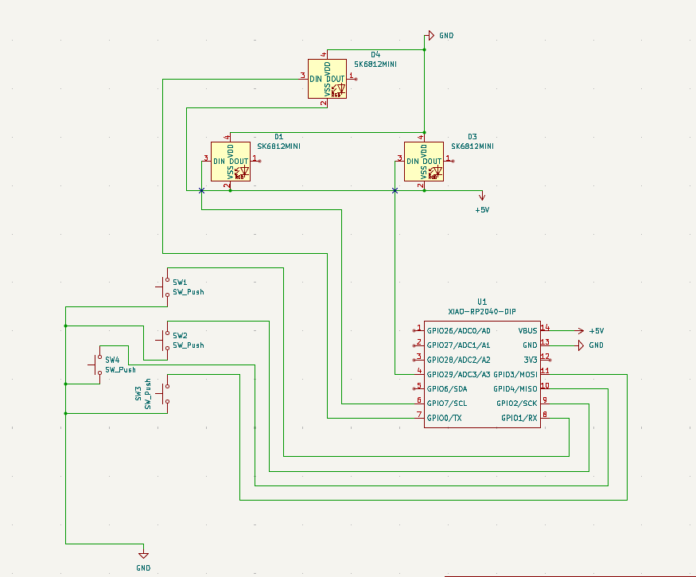
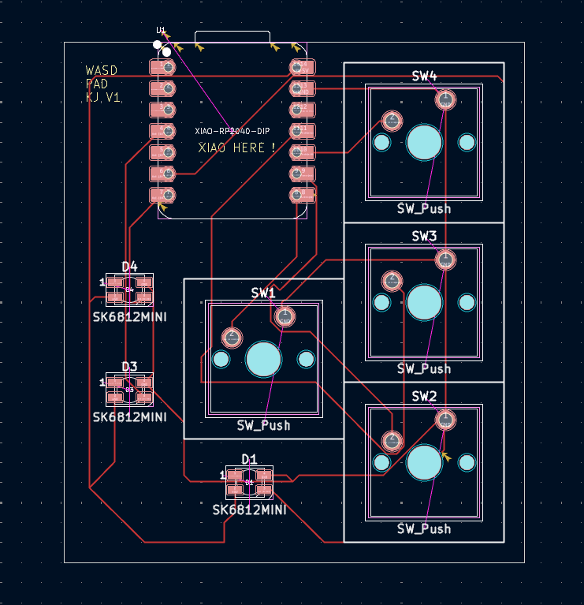
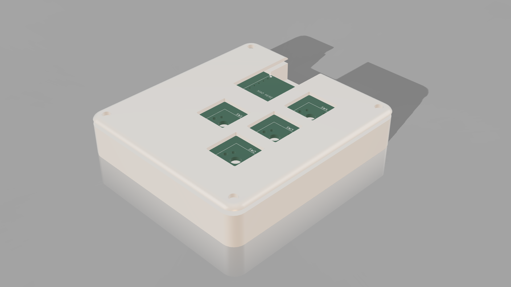

# WASD-PAD

A small 4‑key macropad based on the Seeed XIAO RP2040, customized to act as WASD keys for gaming and shortcuts.  
The board uses MX‑style switches, SK6812‑MINI addressable RGB LEDs, and a 3D‑printed case inspired by the Hack Club Hackpad project.

---

## Features

- 4 mechanical MX‑style switches laid out as WASD
- Seeed XIAO RP2040 as the main controller
- KMK firmware running on CircuitPython
- 4 SK6812‑MINI RGB LEDs for per‑key lighting
- Custom PCB designed in KiCad
- 3D‑printed top and bottom case

---

## Hardware

- 1 × Seeed XIAO RP2040 module  
- 4 × MX‑style mechanical switches  
- 4 × SK6812‑MINI addressable RGB LEDs  
- Custom PCB (KiCad files in `Hardware/`)
  
  
- 3D‑printed case (Fusion 360 / STEP files in `Case/`)
  

See `BOM.xlsv` for the full bill of materials.

---

## Firmware

The firmware is written with KMK:

- Source in the `Firmware/` folder (main file: `firmware.main.py`)
- Keys are wired to XIAO pins D0–D3 and mapped to `W`, `A`, `S`, `D`
- Plug the board in, copy `firmware.main.py` to the CIRCUITPY drive, and it will enumerate as a USB keyboard

---

## Getting Started

1. **Assemble the PCB**  
   - Solder the XIAO RP2040, switches, LEDs, and passives.  
2. **Flash CircuitPython & KMK**  
   - Install CircuitPython on the XIAO and copy the KMK library folder.  
3. **Copy firmware**  
   - Copy `Firmware/firmware.main.py` to the CIRCUITPY drive.  
4. **Print and assemble case**  
   - 3D print the case parts and assemble with M3 screws and heat‑set inserts.

---

